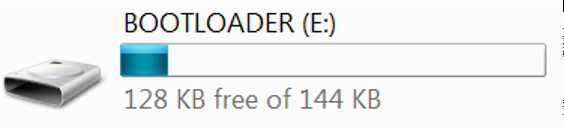

# Unbricking Guide for mbed Devices

Before starting the unbricking process, it will be helpful to determine whether the actual bootloader on your target bricked, or just it's interface. Follow the steps below to determine what needs to be done to recover your board.


## Unbricking Bootloader
Follow the steps in this section if the flowchart at the beginning of the document determined that your board's bootloader has been bricked.

### Step 0: Required items
* [pyOCD](https://github.com/mbedmicro/pyOCD)
* [SWDAP debugging probe](https://developer.mbed.org/platforms/SWDAP-LPC11U35/)
* [10 pin debug cable](https://developer.mbed.org/platforms/SWDAP-LPC11U35/)

### Step 1: Install pyOCD
pyOCD is an Open Source python 2.7 based library for programming and debugging ARM Cortex-M microcontrollers using CMSIS-DAP.  In a terminal you can install pyOCD using the following command:
`sudo pip install pyOCD`

Once pyOCD is installed, make a new directory and put the file `restore_k20dx_firmware.py` at the root of that directory. `restore_k20dx_firmware.py` is a python script used to flash binaries onto a board that has been bricked.

### Step 2: Choose firmware to flash to the board
* Find a working bootloader that you would like to flash to the board, re-name its binary file to rom.bin.
* Place rom.bin that in the same root directory as the python script.

### Step 3: Connect debugger to bricked board
Locate the 10-pin header that is associated with your board's k20dx flash.  Usually the header is located near the OpenSDA USB port on the device.  Connect your 10-pin debug cable to this header, such that pin 1 of the header is connected to the red wire on your debug cable, as seen in the image below. The pin numbering should be printed on the silkscreen of you board for your reference. After the connection is made, ensure that both the debugger and the bricked board are plugged into a power source (usually via USB cable).


### Step 4: Flashing bricked board
Now the bricked board is ready to get flashed with your chosen firmware.  Go to your directory that has the python script, restore_k20dx_firmware.py. To run the script, use the following command (run with superuser privileges): `sudo python restore_k20dx_firmware.py`

The console will then prompt you to specify which board to use as the debugger. The output should look similar to the following:
```
id => usbinfo | boardname
0 => NXP LPC800-MAX [k20d50m]
1 => FRDM-K64F [k20d50m]
input id num to choice your board want to connect
```
Choose id=0 here since that represents the debugger, and then hit enter.  The unbricking should now begin. If successful, the terminal should report as follows:

```
brandon@mint64 ~/Work/pyOCD $ sudo python restore_k20dx_firmware.py
WARNING:root:Invalid coresight component, cidr=0x0
WARNING:root:Invalid coresight component, cidr=0x1010101
WARNING:root:Invalid coresight component, cidr=0x0
Flashing rom.bin to target
Recovery successful
```

### Step 5: Verify
Now unplug and replug the board into your computer normally (without holding down the reset button).  The device should mount normally.

## Unbricking Interface
Follow the steps in this section if the flowchart at the beginning of the document determined that your board's interface has been bricked.

### Step 0: Required items
* Windows 7 machine

### Step 1: Enter device into bootloader mode
Hold down the reset button on your board, and while holding down the button, plug it into a Windows 7 machine.  The board should mount as a BOOTLOADER.



### Step 2: Drag working binary onto your device
Drag and drop your binary onto the device while it is in bootloader mode.

### Step 3: Verify
Now unplug and replug the board into your computer normally (without holding down the reset button).  The device should mount normally.
