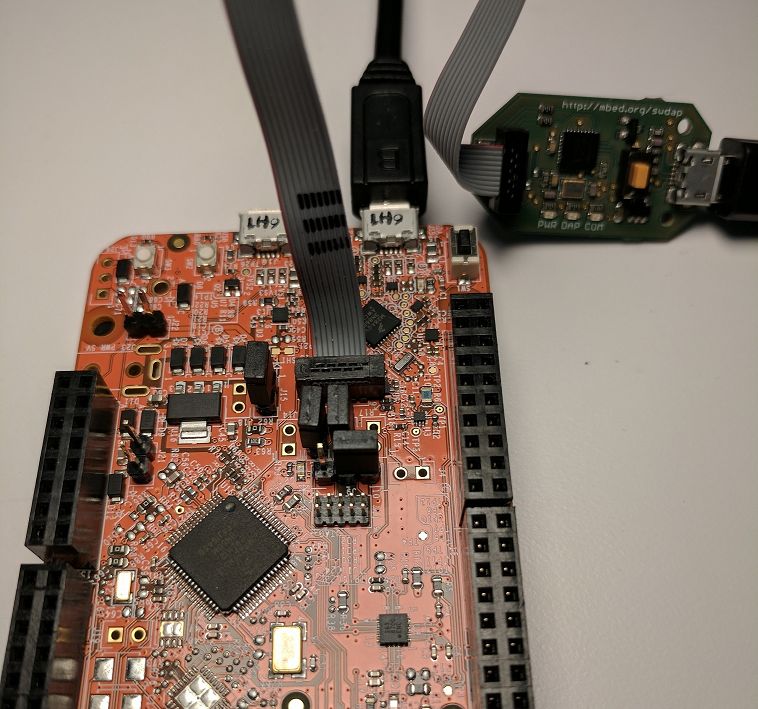

# Unbricking and Updating Corrupted mbed Devices
An older version of DAPLink can potentially brick your microcontroller if you attempt to update its firmware on a Windows 10 machine. When bricked, the application on your device will no longer execute and the device itself will no longer mount in your OS. The bricking is a result of the device's bootloader getting corrupted during the flashing process. We have witnessed the bricking occur on select NXP/Freescale microcontrollers that are packaged with this specific version of DAPLink. If you believe your device is bricked, or worried that it may become bricked, this guide will help you in recovering and updating your board properly.

Fear not, the procedures outlined in this document will NOT cause your board to get bricked. Begin by following the flowchart below to determine what needs to be done to recover and/or safely update the DAPLink firmware on your board.


If the flowchart has determined that your board is _bricked_, then follow the steps in the section `Unbricking corrupted bootloader`. If your device is not bricked, then follow the steps outlined in the section `Safely update with Windows 10`.

## Unbricking corrupted bootloader
Follow the steps in this section if the flowchart at the beginning of the document determined that your board's bootloader has been bricked. Alternatively, if you already have access to a [Segger J-Link](https://www.segger.com/products/debug-probes/j-link/), a [P&E Multilink](http://www.pemicro.com/products/product_viewDetails.cfm?product_id=15320137&productTab=1), or a [FRDM Development Board](http://www.nxp.com/products/software-and-tools/hardware-development-tools/freedom-development-boards:FREDEVPLA), you can follow the steps outline in the tutorial found [here](https://mcuoneclipse.com/2016/06/26/how-to-recover-the-opensda-v2-x-bootloader/). If you follow said tutorial instead, please recover your board using the _DAPlink firmware_ linked in the `Required items` section below.

### Required items
* [pyOCD](https://github.com/mbedmicro/pyOCD).
* [CMSIS-DAP debugging probe](https://developer.mbed.org/platforms/SWDAP-LPC11U35/).
* [10 pin debug cable](https://www.adafruit.com/product/1675).
* [DAPLink firmware](TODO: NEED TO UPDATE ONCE NEW DAPLINK IS RELEASED).

### Step 1: Install pyOCD
pyOCD is an Open Source Python 2.7 based library for programming and debugging ARM Cortex-M microcontrollers using the CMSIS-DAP that is linked above in the `Required items` section. In a terminal, you can install pyOCD using the following command (install as superuser if using a Linux machine):
`pip install pyOCD`

### Step 2: Connect debugger to bricked board
Locate the 10-pin header associated with your board's k20dx flash. Usually, the header is near the OpenSDA USB port on the device. Connect your 10-pin debug cable to this header, so pin 1 of the header connects to the red wire on your debug cable, as seen in the image below. The pin numbering is printed on the silkscreen of your board for your reference. After you have connected the debugger to your board, ensure that both the debugger and the bricked board are plugged into your computer via USB cable.




### Step 3: Flashing bricked board
Now you are ready to flash the bricked board with the updated DAPLink firmware that is linked in the `Required items` section of this tutorial. This updated version of DAPLink will properly restore your bricked device and prevent future bricking. To run pyOCD's flashtool, use the command below (run with superuser privileges if using a Linux machine). Note, replace `<PATH TO DAPLINK BINARY>` with file location of the DAPLink binary on your system.

`pyocd-flashtool <PATH TO DAPLINK BINARY> -t k20d50m`

If you have multiple devices connected to your computer, the console will prompt you to specify which device pyOCD should use as the debugger. The output looks similar to the following:
```
id => usbinfo | boardname
0 => NXP LPC800-MAX [k20d50m]
1 => FRDM-K64F [k20d50m]
input id num to choice your board want to connect
```
In this list, `id=0` represents the debugger. Therefore, you would type `0` and then hit `Enter`.

The unbricking begins, and the terminal reports something like the following:

```
INFO:root:DAP SWD MODE initialised
WARNING:root:K20D50M in secure state: will try to unlock via mass erase
WARNING:root:K20D50M secure state: unlocked successfully
INFO:root:ROM table #0 @ 0xe00ff000 cidr=b105100d pidr=4000bb4c4
INFO:root:[0]<e000e000:SCS-M3 cidr=b105e00d, pidr=4000bb000, class=14>
WARNING:root:Invalid coresight component, cidr=0x0
INFO:root:[1]<e0001000: cidr=0, pidr=0, component invalid>
INFO:root:[2]<e0002000:FPB cidr=b105e00d, pidr=4002bb003, class=14>
WARNING:root:Invalid coresight component, cidr=0xb1b1b1b1
INFO:root:[3]<e0000000: cidr=b1b1b1b1, pidr=b1b1b1b1b1b1b1b1, component invalid>
WARNING:root:Invalid coresight component, cidr=0x0
INFO:root:[4]<e0040000: cidr=0, pidr=0, component invalid>
INFO:root:CPU core is Cortex-M4
INFO:root:6 hardware breakpoints, 4 literal comparators
INFO:root:4 hardware watchpoints
[====================] 100%
INFO:root:Programmed 131072 bytes (128 pages) at 25.32 kB/s

```

### Step 4: Verify
Now, unplug and replug the board into your computer normally (without holding down the reset button). The device mounts normally, and the update is complete.

## Safely update with Windows 10
If the flowchart in the beginning of the document sent you to this section, then follow the steps below to safely update your device on a Windows 10 machine.

### Required items
* Windows 10 machine
* [DAPLink firmware](TODO: NEED TO UPDATE ONCE NEW DAPLINK IS RELEASED).

### Step 1: Disable storage services
Right click the _Start Button_ in Windows 10, and then left click _Run_. Once the run prompt opens, type in ```services.msc``` and click the _OK_ button.


Once the Services application opens, double click the item from the list named _Storage Service_.  


Storage Service Properties is now open. Click the button named _Stop_.


### Step 2: Update firmware
While holding the board's reset button, connect it to your computer via the board's OpenSDA UDB port. A device will mount with the name _BOOTLOADER_. Open up the _BOOTLOADER_ directory, and then drag and drop the firmware that is linked in the `Required items` section of this tutorial. The board will begin the updating process.

### Step 3: Verify
Allow the update a few seconds to complete, and then unplug and replug the board into your computer normally (without holding down the reset button). The device mounts normally, and the update is complete.

### Step 4: Re-enable storage services
Turn storage services back on by following the same steps listed in ```Step 1: Disable storage services```, but this time click the button name _Start_ instead of _Stop_.
