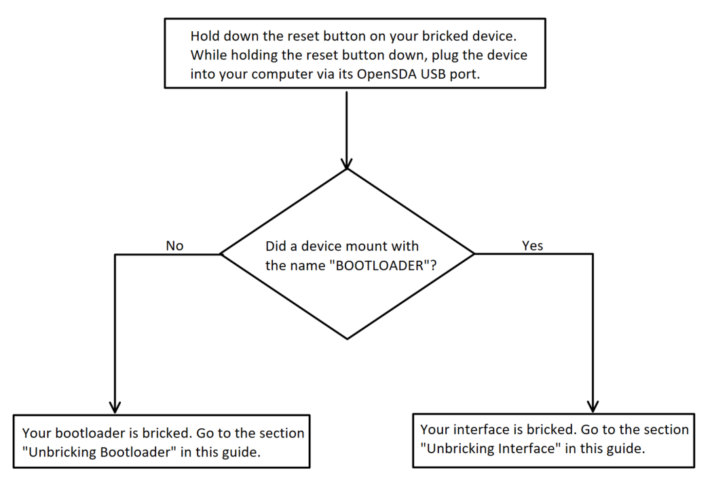
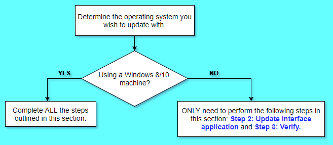
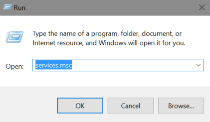
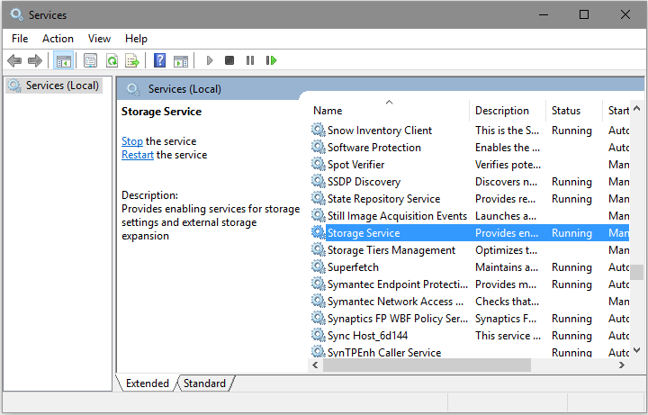
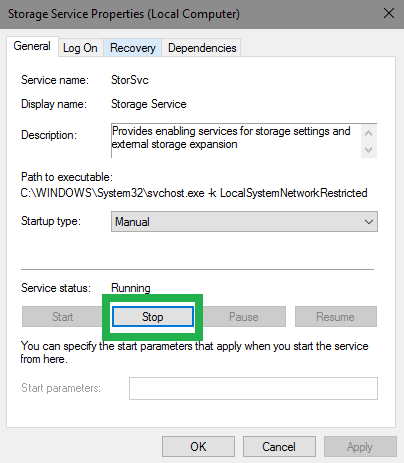
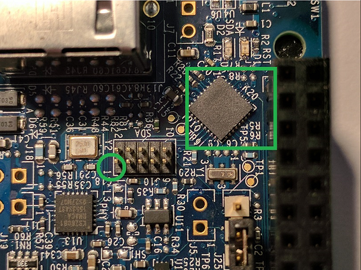

# Mbed Enabled boards and Windows 10
There have been questions asked in the forums about Windows 10 bricking mbed Enabled development boards when updating the interface firmware. We decided to look further into this to understand, reproduce and root cause the problem. The symptom has been described as "bricking" or not mounting as a mass storage drive when connected to the computer over USB. During the investigation, we found the problem and that it could manifest itself in two ways yielding comparable results, the boards appearing to be bricked. In one case, the interface application received out of expected order data and writes it to the device which causes it to crash on reboot. In the second case, the out of order sequence is not handled well and erases the bootloader which does brick the device. While this could happen on any operating system its only manifested on Windows 8 and 10 when storage services are running. The user facing result of this is that updating the DAPLink firmware using a Windows 8 or 10 can potentially have their bootloaders bricked or interface application firmware corrupted causing a software crash where the interface application will no longer execute. We have tracked this down to the following list of NXP/Freescale development boards that are shipped with bootloader version "####". If you believe your device is bricked, or worried that it may become bricked, this guide will help you in recovering and updating your board properly.

<<insert list of boards and versions here>>

The procedures outlined in this document will NOT leave your board in a unrecoverable state. Begin by following the flowchart below to determine what needs to be done to recover and/or safely update the DAPLink firmware on your board.



If the flowchart has determined that your board is _bricked_, then follow the steps in the section `Reprogramming the bootloader`. If your device is not bricked, then follow the steps outlined in the section `Safely update device`.

## Safely update device
To recover a board with the bootloader is still intact we just need to reprogram the debug interface application.



### Required items
* [DAPLink firmware](TODO: NEED TO UPDATE ONCE NEW DAPLINK IS RELEASED).

### Step 1: Disable storage services
On your Windows 8/10 machine, press and hold the Windows Logo Key and then press R. This will open the windows _Run_ prompt. Once the _Run_ prompt opens, type in ```services.msc``` and click the _OK_ button.



Once the Services application opens, double click the item from the list named _Storage Service_.  



Storage Service Properties is now open. Click the button named _Stop_.



### Step 2: Update debug interface application
While holding the board's reset button, connect it to your computer via the board's OpenSDA UDB port. A device will mount with either the name _BOOTLOADER_, _MAINTENANCE_, or something similar. Open up this device's directory, and then drag and drop the [latest DAPLink debug application](Download link for file). The board will begin the updating process.

### Step 3: Verify
Allow the update a few seconds to complete, and then unplug and replug the board into your computer normally (without holding down the reset button). The device mounts normally, and the update is complete.

### Step 4: Re-enable storage services
Turn storage services back on by following the same steps listed in ```Step 1: Disable storage services```, but this time click the button name _Start_ instead of _Stop_.

## Reprogramming the bootloader
If your bootloader has been partially erased we can use another development board to reprogram an updated bootloader.

### Required items
* [pyOCD](https://github.com/mbedmicro/pyOCD).
* <<any freescale  development board….. >>
* [10 pin debug cable](https://www.adafruit.com/product/1675).
* [DAPLink bootloader](TODO: NEED TO UPDATE ONCE NEW DAPLINK IS RELEASED).

### Step 1: Install pyOCD
pyOCD is an Open Source Python based library for programming and debugging ARM Cortex-M microcontrollers using the CMSIS-DAP that is linked above in the `Required items` section. With Python 2.7 installed, you can then install pyOCD using the following command (install as superuser if using a Linux machine):
`pip install pyOCD`

### Step 2: Connect debugger to board
Locate the 10-pin header associated with your board's k20dx interface MCU. Usually, the header is near the OpenSDA USB port on the device. Connect your 10-pin debug cable to this header, so pin 1 of the header connects to the red wire on your debug cable, as seen in the image below. The pin numbering is printed on the silkscreen of your board for your reference. After you have connected the debugger to your board, ensure that both the debugger and the bricked board are plugged into your computer via USB cable.



<<image should be a freescale board connected to a freescale board>>

### Step 3: Flashing the new bootloader
Now you are ready to flash the board with the [updated DAPLink bootloader](Link bootloader file here too). To run pyOCD's flashtool, use the command below (run with superuser privileges if using a Linux machine). Note, replace `<PATH TO DAPLINK BINARY>` with file location of the DAPLink binary on your system.

`pyocd-flashtool <PATH TO DAPLINK BINARY> -t k20d50m`

If you have multiple devices connected to your computer, the console will prompt you to specify which device pyOCD should use as the debugger. The output looks similar to the following:
```
id => usbinfo | boardname
0 => NXP LPC800-MAX [k20d50m]
1 => FRDM-K64F [k20d50m]
input id num to choice your board want to connect
```
In this list, `id=0` represents the debugger. Therefore, you would type `0` and then hit `Enter`.

The reprogramming begins, and the terminal reports something like the following:

```
INFO:root:DAP SWD MODE initialised
WARNING:root:K20D50M in secure state: will try to unlock via mass erase
WARNING:root:K20D50M secure state: unlocked successfully
INFO:root:ROM table #0 @ 0xe00ff000 cidr=b105100d pidr=4000bb4c4
INFO:root:[0]<e000e000:SCS-M3 cidr=b105e00d, pidr=4000bb000, class=14>
WARNING:root:Invalid coresight component, cidr=0x0
INFO:root:[1]<e0001000: cidr=0, pidr=0, component invalid>
INFO:root:[2]<e0002000:FPB cidr=b105e00d, pidr=4002bb003, class=14>
WARNING:root:Invalid coresight component, cidr=0xb1b1b1b1
INFO:root:[3]<e0000000: cidr=b1b1b1b1, pidr=b1b1b1b1b1b1b1b1, component invalid>
WARNING:root:Invalid coresight component, cidr=0x0
INFO:root:[4]<e0040000: cidr=0, pidr=0, component invalid>
INFO:root:CPU core is Cortex-M4
INFO:root:6 hardware breakpoints, 4 literal comparators
INFO:root:4 hardware watchpoints
[====================] 100%
INFO:root:Programmed 131072 bytes (128 pages) at 25.32 kB/s

```

### Step 2: Update debug interface application
While holding the board's reset button, connect it to your computer via the board's OpenSDA UDB port. A device will mount as _MAINTENANCE_. Open up this device's directory, and then drag and drop the [latest DAPLink debug application](Download link for file). The board will begin the updating process.

### Step 5: Verify
Now, unplug and replug the board into your computer normally (without holding down the reset button). The device mounts normally, and the update is complete.
