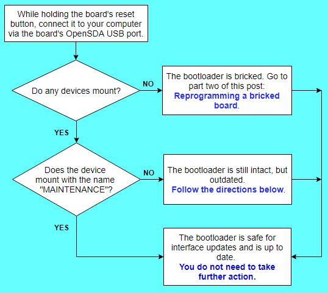

# Mbed Enabled boards and Windows 10
There have been questions asked in the forums about Windows 10 bricking mbed Enabled development boards when updating the interface firmware. We looked further into this to understand, reproduce, and find a solution to the problem. The symptom has been described as "bricking" or not mounting as a mass storage drive when connected to the computer over USB. During the investigation, we found that the problem can manifest itself in two different ways, with both cases making the boards appear bricked. In one case, the interface application receives data in an unexpected order causing the application to crash on reboot. In the second case, the out of order sequence erases the bootloader, resulting in a bricked device. While this could happen on any operating system, it has only manifested on Windows 8 and Windows 10 machines when storage services are running. The user facing result of this is that updating DAPLink firmware on a Windows 8 or Windows 10 machine can result in a bricked bootloader or corrupted application interface, both of which will prevent the user's application from running.

If you believe your device is bricked or corrupted, or worried that it may become bricked or corrupted, this guide will help you update your board properly. After performing the update, your board should no longer be susceptible to bricking/corruption from the reasons explained in the paragraph above. Also, the procedures outlined in this document will NOT leave your board in a unrecoverable state. We have narrowed down specific versions that are susceptible to corruption and bricking, and if interested, more information on that can be found below in the section [Versions susceptible to bricking and corruption](#versions). The next step is to follow the flowchart below to determine what needs to be done to recover and/or safely update the DAPLink firmware on your board.

<a name="flowchart">

If the flowchart determined that your bootloader is still intact, but outdated, then begin by following the steps in the section [Safely update outdated bootloader](#outdated). If the flowchart determined that your bootloader was bricked, then begin by following the steps in the section [Reprogramming a bricked bootloader](#bricked). Else, if the flowchart determined that your bootloader is safe for interface updates, then your board is not susceptible to the bricking/corruption issues discussed earlier, and interface updates can be completed by following the steps in the section [Normal interface update procedures](#normal_update), found at the bottom of this guide.

## <a name="versions"></a>Versions susceptible to bricking and corruption
This section is not required to perform any firmware updates, but can provide you with further information on the interface and bootloader versions that are susceptible to bricking and corruption. We have determined that NXP/Freescale development boards containing bootloader version 1000 are susceptible for bricking. NXP/Freescale development boards containing interface version below 0240 are susceptible to having their interfaces corrupted. We are uncertain of all the boards and their revisions that came packaged with these versions, but either way, it is always recommended to update your board to use the latest versions. The remaining portions of this section will explain the steps needed to check your board's current interface and bootloader versions. When finished with this section, please continue to the [flowchart](#flowchart) found at the beginning of this guide to determine your next steps.

### Checking interface version
Assuming your board's interface is not yet corrupted, you can check its interface version number by plugging your board into your computer via the board's OpenSDA USB port, and then opening up the `DETAILS.TXT` file found at the root directory of the device. If that file is not present, then open up the `.HTM` file with a text editor.

### Checking bootloader version
Assuming your board's bootloader is not yet bricked, you can check its version number by doing the following. While holding down the board's reset button, plug the device into your computer via the board's OpenSDA USB port. If your board is not already bricked, a device will mount.  Inside the root directory of that device, the version number can be found by opening the `DETAILS.TXT` file. If that file is not present, then open up the `.htm` file with a text editor.

## <a name="outdated"></a>Safely update outdated bootloader
If you were directed to this section, then your board has an outdated bootloader. This section will show you how to safely update your outdated bootloader, and then will direct you on how to update to the latest interface firmware. Begin by following the flowchart below.


### Required items
* [Updated DAPLink bootloader package](TODO: This should link to the 0244 package which has the bootloader update embedded into the interface update).

### <a name="step1"></a>Step 1: Disable storage services (for Windows 8/10 machines only)
On your Windows 8 or Windows 10 machine, press and hold the Windows Logo Key and then press R. This will open the windows _Run_ prompt. Once the _Run_ prompt opens, type in `services.msc` and click the _OK_ button.


Once the Services application opens, double click the item from the list named _Storage Service_.  


Storage Service Properties is now open. Click the button named _Stop_.


### Step 2: Update the bootloader
If you have not done so already, download the [Updated DAPLink bootloader package](TODO: This should link to the 0244 package which has the bootloader update embedded into the interface update). When you unzip the package, locate the file which contains the name of the board you are trying to update. This will be the file used to update your device.

While holding the board's reset button, connect it to your computer via the board's OpenSDA USB port. The device should mount in its bootloader mode. Open up this device's root directory, and then drag and drop the firmware update into this directory. The board will begin the updating process.

Allow the update a few seconds to complete, and then unplug and replug the board into your computer normally (without holding down the reset button). You device now has the updated bootloader, and the will mount normally. If you are using a Windows 8 or Windows 10 machine, continue to the next step, [Step 3: Re-enable storage services](#step3). If you are updating on some other operating system, then jump straight to the section [Normal interface update procedures](normal_update) found at the end of this guide.

### <a name="step3"></a>Step 3: Re-enable storage services (for Windows 8/10 machines only)
On your Windows 8 or Windows 10 machine, turn storage services back on by following the same steps listed in [Step 1: Disable storage services](#step1), but this time click the button name _Start_ instead of _Stop_. After that, follow the steps in the section [Normal interface update procedures](#normal_update) found at the end of this guide.

## <a name="bricked"></a>Reprogramming a bricked bootloader
If you were directed to this section, then your bootloader has been bricked and will require a debugger to reprogram it. After the bootloader has been reprogrammed, all that remains is updating its interface. Begin by following the steps below.

### Required items
* Debugger (Step 1 below will discuss various options available).
* [pyOCD](https://github.com/mbedmicro/pyOCD).
* [10 pin debug cable](https://www.adafruit.com/product/1675).
* [updated DAPLink bootloader](TODO: Link updated 0244-k20dx bootloader file here).

### Step 1: Acquire a debugger
There are a few different options here when it comes to using the debugger to reprogram your bootloader. One option is to use a [CMSIS-DAP](https://developer.mbed.org/platforms/SWDAP-LPC11U35/) debugging probe. Alternatively, it is possible to use another FRDM board to program your bricked board. Depending on the board, a SWD header needs to be soldered on the board and jumpers set or traces cut. Here are some tutorials on how to modify the [FRDM-K64F](https://mcuoneclipse.com/2015/09/08/using-frdm-k64f-board-to-debug-another-kinetis-board/), [FRDM-KL25Z](https://mcuoneclipse.com/2013/04/21/using-the-freedom-board-as-jtag-programmer/), and [FRDM-KL43Z](https://mcuoneclipse.com/2015/08/19/using-the-freescale-freedom-frdm-kl43z-to-debug-other-boards/) to do just that.

### Step 2: Install pyOCD
pyOCD is an Open Source Python based library for programming and debugging ARM Cortex-M microcontrollers using a debugger. With Python 2.7 installed, you can then install pyOCD using the following command (install as superuser if using a Linux machine):
`pip install pyOCD`

### Step 3: Connect debugger to bricked board
Locate the 10-pin header associated with your bricked board's k20dx interface MCU. Usually, the header is near the OpenSDA USB port on the device. Connect your 10-pin debug cable to this header, so pin 1 of the header connects to the red wire on your debug cable. The pin numbering is printed on the silkscreen of your board for your reference. In the image below, I drew a green square around the k20dx interface MCU found on a bricked FRDM-K22F, and a green circle around pin 1 of its corresponding 10-pin header.


After this, connect the debugger to your bricked board. Ensure that both the debugger and the bricked board are plugged into your computer via USB cable so that they have power. The image below is an example of how to use a FRDM-K64F as a debugger to reprogram a bricked FRDM-K22F.


### Step 4: Flashing the updated bootloader
Now you are ready to flash the board with the [updated DAPLink bootloader](TODO: Link updated 0244-k20dx bootloader file here). To run pyOCD's flashtool, use the command below (run with superuser privileges if using a Linux machine). Note, replace `<PATH TO DAPLINK BINARY>` with file location of the DAPLink binary on your system.

`pyocd-flashtool <PATH TO DAPLINK BINARY> -t k20d50m`

If you have multiple devices connected to your computer, the console will prompt you to specify which device pyOCD should use as the debugger. The output will look similar to the following:
```
id => usbinfo | boardname
0 => NXP LPC800-MAX [k20d50m]
1 => FRDM-K64F [k20d50m]
input id num to choice your board want to connect
```
From this list, choose the id number which represents your debugger and then hit `Enter`.

The reprogramming begins, and the terminal reports something like the following:

```
INFO:root:DAP SWD MODE initialised
WARNING:root:K20D50M in secure state: will try to unlock via mass erase
WARNING:root:K20D50M secure state: unlocked successfully
INFO:root:ROM table #0 @ 0xe00ff000 cidr=b105100d pidr=4000bb4c4
INFO:root:[0]<e000e000:SCS-M3 cidr=b105e00d, pidr=4000bb000, class=14>
WARNING:root:Invalid coresight component, cidr=0x0
INFO:root:[1]<e0001000: cidr=0, pidr=0, component invalid>
INFO:root:[2]<e0002000:FPB cidr=b105e00d, pidr=4002bb003, class=14>
WARNING:root:Invalid coresight component, cidr=0xb1b1b1b1
INFO:root:[3]<e0000000: cidr=b1b1b1b1, pidr=b1b1b1b1b1b1b1b1, component invalid>
WARNING:root:Invalid coresight component, cidr=0x0
INFO:root:[4]<e0040000: cidr=0, pidr=0, component invalid>
INFO:root:CPU core is Cortex-M4
INFO:root:6 hardware breakpoints, 4 literal comparators
INFO:root:4 hardware watchpoints
[====================] 100%
INFO:root:Programmed 131072 bytes (128 pages) at 25.32 kB/s

```

Once the reprogramming is complete, the bootloader will now be updated. The next step is to update your device's interface. Follow the steps in the section [Normal interface update procedures](#normal_update) found below.

## <a name="normal_update"></a>Normal interface update procedures
If you were directed to this section, then your board has the updated bootloader in place and your device is no longer susceptible to the bricking/corruption issues explained at the beginning of this guide. At this point, normal interface update procedures can be followed. To update to the latest interface firmware, you will need to download the most recent DAPLink release package found at [DAPLink's github page](https://github.com/mbedmicro/DAPLink/releases). On this page, locate the most up-to-date release package and then download and unzip the package. After unzipping, find the file containing the name of the board you are trying to update. This will be the file used to update your device's interface.

While holding the board's reset button, connect it to your computer via the board's OpenSDA USB port. A device will mount as _MAINTENANCE_. Open up the device's root directory and then drag and drop the firmware update into this directory. The board will begin the updating process and should complete after a few seconds. Now, unplug and replug the board into your computer normally (without holding down the reset button). The device will mount, and the update is complete.
